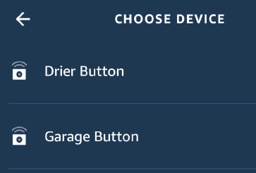
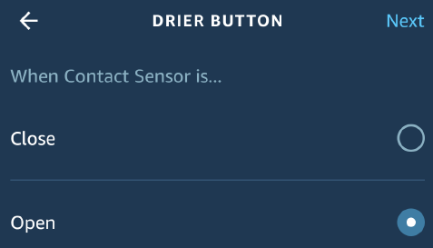

## Usage

Following the installation setup you should have defined a password
and know the HTTP URL endpoint.  For simplicity I will just refer to
them as `$PASS` and `$URL`.  Remember these should be kept secret so
that no one can abuse your API (cost money) or trigger your Alexa.

The primary method of configuring Virtual Buttons is via the API.

A typical request from a Unix command line would look like

    curl -H "Authorization: $PASS" $URL -d '{_json_}'

The JSON has three parameters:

* command: This is the command to be called
* param1: The first parameter (optional)
* param2: The second parameter (optional)

The result should be a JSON with the label of "answer" containing a
results string.

So, for example, to list the buttons defined we could simply do:

    curl -H "Authorization: $PASS" $URL -d '{"command":"getbuttons"}'

The Makefile has some examples.

Alternatively there is an _insecure_ mode using GET requests.  Normally
a GET is a bad idea because it may be logged (e.g. at proxies) and
so this might expose the password.  To enable insecure mode you need
to set button 100004 to hold the word `insecure` (see the installation
guide on how to set buttons).

In insecure mode you can make a GET request of the form

    $URL?cmd=$PASS/command/param1/param2

So you might do

    curl $URL?cmd=$PASS/pushcontact/12

Beware if using names with spaces in; spaces would need to be changed to
`%20`; e.g. "Front Door" would become

    $URL?cmd=$PASS/pushcontactbyname/Front%20Door

Because this mode isn't recommended the rest of the documentation will
use the POST/JSON mode.

### Buttons

Buttons have a number, a name and a state.  The state may be 0 == CLOSED == OFF, or 1 == OPEN == ON.

Alexa Smart Home routines can handle 100 devices.  Button numbers don't
need to be sequential.  Keep them below 100,000 otherwise you'll overwrite
some of the magic numbers.

### Button Management

After you create/change/delete buttons you should do a Device Discovery
in Alexa so it picks up the buttons.  Sometimes this doesn't return
immediately ("no new devices") but then they show up some seconds later.
From the mobile app I just select type "Other" when doing a discovery.

#### Create/Change button

To create a button use the `setname` command.  Param1 is the button number,
Param2 is the name.  The result is the name of the button.  This can also
be used to change the name of a button.

Example: `{"command":"setname", "param1":"1", "param2":"Test Button 1"}`<br>
Response: `{"Answer:":"Test Button 1"}`

Example: `{"command":"setname","param1":"10", "param2":"Garage Door"}`<br>
Response: `{"Answer:":"Garage Door"}`

#### List buttons

To list the buttons defined, use the `getbuttons` command.  This also
lists the ON/OFF state of the button

Example: `{"command":"getbuttons"}`<br>
Response: `{"Answer:":"     1 OFF Test Button 1\n    10 OFF Garage Door\n"}`

#### Delete button

To delete a button, use the `deletebutton` command.

Example: `{"command":"deletebutton","param1":"1"}`<br>
Response: `{"Answer:":""}`

### Turning buttons on/off

This mode would be used to emulate a traditional on/off switch, or to
emulate a door or window which can be open or closed.

#### By button number

The `setstate` command will turn on/off a button.

Example: `{"command":"setstate","param1":"1","param2":"1"}`<br>
Response: `{"Answer:":"Test Button 1"}`

#### By button name

`setstatebyname` lets you use the name of the button

Example: `{"command":"setstatebyname","param1":"Garage Door","param2":"1"}`<br>
Response: `{"Answer:":"Update Success"}`

### Toggling a button

This can be used to model a "push button" style on/off switch where you
push it once to turn something on and push it again to turn it off.

#### By button number

The `togglestate` command will change the state of a button; if it was
previously ON it will now be OFF, and vice versa.

Example: `{"command":"togglestate","param1":"1"}`<br>
Response: `{"Answer:":"Test Button 1"}`

#### By button name

`togglestatebyname` lets you use the name of the button.

Example: `{"command":"togglestatebyname","param1":"Garage Door"}`<br>
Response: `{"Answer:":"Garage Door"}`

### Momentary Push contact

This can be used to emulate a door bell or garage door opener type button.
It can also be used for "events" (e.g. "Washing machine finishing").  What
it does at the backend is turn the switch ON and then turn it OFF again,
so there are two potential triggers sent to Alexa that can be picked up
in a routine.

#### By button number

The `pushcontact` pushes a button

Example: `{"command":"pushcontact","param1":"1"}`<br>
Response: `{"Answer:":"Update Success"}`

#### By button name

The `pushcontactbyname` lets you push a button using its name

Example: `{"command":"pushcontactbyname","param1":"Garage Door"}`<br>
Response: `{"Answer:":"Update Success"}`

## Using a button in an Alexa routine

Now we've defined our buttons (and discovered them!) they can be used in
a routine.

In this example I'm going to set up an action for my Drier.

Define your routine in the normal way.  For the "When this happens" question
click on the Smart Home icon.  This should show you buttons!  Select the
one you want to trigger on.



Then you'll be asked to act on the Close or Open action.  Remember,
for a sensor "Closed" is "OFF" and "Open" is "ON", so pick your trigger
accordingly.



Now I want Alexa to speak to me, so I picked the Action "Messaging",
and then the "Send Announcement" option.  Enter the words you want her
to say and then select the Echo devices you want her to say it out of.
You can select multiple devices, and they'll all announce.


Now you can test it by sending a command to the Virtual Button.

`{"command":"pushcontactbyname", "param1":"Drier Button"}`

After a second you should hear a _bingbong_ and your announcement.

## Integrating with Home Assistant

Now this was the main point of all of this!  I want to get Alexa to speak
to me as part of automations.

First we need to define the `rest_command` service function.  In `configuration.yaml`

```
# This will let us use Alexa for announcements
rest_command:
  alexa:
    url: !secret alexa_url
    method: POST
    headers:
      authorization: !secret alexa_secret
    payload: '{"command": "{{ command }}", "param1": "{{ param1 }}", "param2": "{{ param2 }}" }'
```

Notice I'm making use of the `secrets.yaml` file to store the URL and PASS
values so they're not in the main code.

This can now be used in an automation action.  For example:

```
  action:
    - service: rest_command.alexa
      data:
        command: "pushcontactbyname"
        param1: "Drier Button"
        param2: "0"
```

Define `param2` even if it's not needed.


It can be used with conditionals as well.  For example I have this action
set for my Garage Door (which I [made smart](https://www.sweharris.org/post/2019-05-19-garage/)).

```
    - service: rest_command.alexa
      data:
        command: "setstatebyname"
        param1: "Garage Button"
        param2: >
          
          0
          
          1
          
```

This will create OPEN and CLOSE events, and I created two Alexa routines,
one for each, so now I get alerted if the garage door is opened.

## Advanced Usage (for experienced AWS users)

If you are experienced with AWS and know how to use the CLI then you will
likely have created API keys for use.  The `bootstrap` program that is used
for the Lamba can _also_ use these keys, so you have an alternate way
of running commands.  This is done with the `-command` option

e.g.

```
% ./bootstrap -command getbuttons
    10 OFF Garage Button
    11 OFF Washer Button
    12 OFF Drier Button
```

Now this doesn't call the Lamba but talks directly to DynamoDB _and_
talks directly to the "push notification" endpoint that tells Alexa about
changes.

Unsurprisingly the command names are the same as those used by the API
so you can do

```
% ./bootstrap -command setname 1 "Test Button 1"
Test Button 1

% ./bootstrap -command getbuttons
     1 OFF Test Button 1
    10 OFF Garage Button
    11 OFF Washer Button
    12 OFF Drier Button
```

You _may_ see some of the diagnostic debugging data that would normally
be sent to CloudWatch logs.  Be careful, this may contain some sensitive
data

```
% ./bootstrap -command setstatebyname "Test Button 1" 1
2021/04/21 17:35:49 Pushing a notification to Alexa
2021/04/21 17:35:49 No refresh needed
2021/04/21 17:35:49 {"event":{"header":{"namespace":"Alexa",...}}}
2021/04/21 17:35:49 Body response:
Update Success
```

That JSON event string a token that authenticates to the Alexa service
as you.  So beware :-)

This option isn't really meant for "real" use, but as a way of
testing/debugging routines.  Indeed it started off as a "-test" command,
until I realised I could use the same logic for the API Gateway!

But it can be a simple way of managing buttons (set/list/delete), as
well as the initial setup of the secrets and passwords.

e.g. instead of having to run

```
% curl https://abcdefghij.execute-api.us-east-1.amazonaws.com/default/Smart_Home_Virtual_Buttons -d '{"command":"setpasswd", "param1":"foobar"}'
```

You could instead just run

```
% ./bootstrap -command setpasswd "foobar"
```

Which is clearly a lot simpler!

This does rely on you having a good AWS setup, though, to let you talk to
DynamoDB, so I consider it "advanced"

